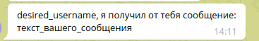

# FactoryApp
**Документация запросов для Factory App**

**Все запросы тестировались в Postaman утилите**

1. **Регистрация пользователя**:

      URL: http://128.199.28.35/api/users/register/
    
      Метод: POST
    
      Тело запроса:
    ```
      {
            "username": "желаемое_имя_пользователя",
            "password": "желаемый_пароль"
      }
    ```

2. **Авторизация**:

   URL: http://128.199.28.35/auth/token/

   Метод: POST

   Тело запроса:

    ```
     {
           "username": "желаемое_имя_пользователя",
           "password": "желаемый_пароль"
     }
    ```
    Ответ содержит **access** и **refresh** токены.

3. **Обновление JWT токена**:
    
   URL: http://128.199.28.35/auth/token/refresh/

   Метод: POST

   Тело запроса:

   ```
    {
      "refresh": "ваш_refresh_токен"
    }
   ```
   
4. **Генерация токена для Telegram**:

   URL: http://128.199.28.35/api/users/get-telegram-token/

   Метод: GET

   Заголовки:

   ```
    {
      "Authorization": "Bearer ваш_access_токен"
    }
   ```
   
5. **Получение списка всех пользователей**

   URL: http://128.199.28.35/api/users/

   Метод: GET

   Заголовки:

   ```
    {
      "Authorization": "Bearer ваш_access_токен"
    }
   ```
   
6. **Отправка сообщения**:

   URL: http://128.199.28.35/api/messages/

   Метод: POST

   Заголовки:

   ```
    {
      "Authorization": "Bearer ваш_access_токен"
    }
   ```
   
   Тело запроса:

   ```
    {
      "text": "текст_вашего_сообщения"
    }
   ```
    
7. **Просмотр своих сообщений**:

   URL: http://128.199.28.35/api/messages/

   Метод: GET

   Заголовки:

   ```
    {
      "Authorization": "Bearer ваш_access_токен"
    }
   ```
   Ответ: Возвращает список всех сообщений, отправленных и полученных вами.


**Внимание:** После запроса 4 - **Генерация токена для Telegram**

Вы переходите в телеграм бота @Factoryest_bot 

и отправляете команду **/start**

Далее, отправляете ему Телеграмм токен, который вы получили.

После привязки, бот пишет что вы успешно привязаны!

Далее, после запроса 6 - **Отправка сообщения**. 

Все ваши сообщения дублируются в Телеграм бота в таком формате:


{Имя пользователя}, я получил от тебя сообщение:

{Сообщение}

Пример:


